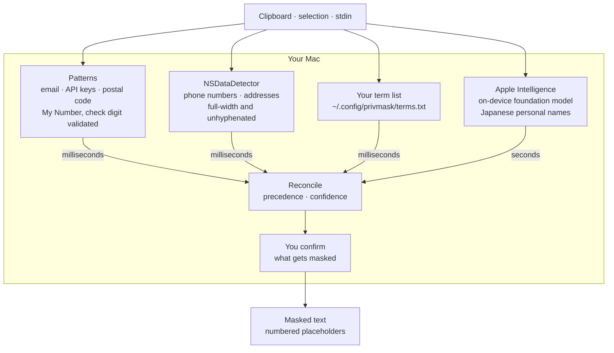

<h1 align="center">🙈<br />privmask</h1>

<p align="center">
  Mask personal information in text before you share it.<br />
  On device, with Japanese handled properly.
</p>

```console
$ cat incident.txt | privmask
■ 影響
[TERM_1]（担当: [NAME_1] 様、[PHONE_1] / [EMAIL_1]）から問い合わせあり。
デプロイ: commit 4f2a1c9e8b3d5a7f6c0e9d2b1a8f7e6d5c4b3a29 / v2.14.3
```

Before pasting a log, an incident write-up or a customer record into Slack or a
GitHub issue, you want the personal information out of it. Existing tools are
regex-based, which is why they miss the things that matter in Japanese: names,
addresses and My Numbers cannot be found by pattern matching.

## Everything happens on your Mac



**No arrow leaves that box, and that is not a simplification of the diagram.**
There is no API key to configure, no account to create, no endpoint to allow
through a proxy, and no rule set fetched from a server. Unplug the network and
nothing changes. The text you are trying to keep private is never the payload of
a request, because there are no requests.

This is what Apple Intelligence buys here. Finding a Japanese personal name
takes a language model — patterns cannot do it, and neither can Apple's own
`NLTagger`, which has no Japanese entity model at all. Until the on-device
foundation model existed, the only way to get that capability was to send the
text to somebody's server, which for this particular job means handing over the
exact thing you were trying not to share.

The two speeds in the diagram are why the tool feels immediate: the
deterministic detectors return in milliseconds and are shown straight away, and
the model's findings are folded in when they arrive rather than making you wait
on a blank screen.

## Read this before you rely on it

**Japanese personal names are found only by Apple Intelligence's on-device
model**, and that model needs **macOS 26 with Apple Intelligence enabled**.
Below that, names are not detected at all — `NLTagger` has no Japanese entity
model, which is a platform limitation,
[measured and documented](docs/findings/apple-detector-baseline.md), not
something this tool can work around.

The model is **on by default** wherever it is available, and skipped with a
warning wherever it is not. Read those warnings. The worst way to use this is to
paste something believing it was masked when it was not.

### What works on which macOS

| | 13 – 25 | 26, Apple Intelligence off | 26, Apple Intelligence on |
|---|:--:|:--:|:--:|
| Phone numbers, addresses | ✅ | ✅ | ✅ |
| Email, postal codes, API keys, My Number | ✅ | ✅ | ✅ |
| Your term list, matched exactly | ✅ | ✅ | ✅ |
| English personal names | ✅ | ✅ | ✅ |
| **Japanese personal names** | ❌ | ❌ | ✅ |
| Spelling variants of your terms | ❌ | ❌ | ✅ |

Turning the model off — `--no-model`, or the *Use the on-device language model*
preference in the Raycast extension — makes privmask fully deterministic and
much faster, at the cost of every row marked ✅ only in the last column.

Other limits worth knowing:

- Only the first 1,500 characters of Japanese are examined for names. Beyond
  that, names are left in place and a warning is printed.
- The model varies between runs. It finds every name in the test corpus most
  times, not every time.
- Your own terms are matched exactly; spelling variants are matched only when
  the model is available.
- Masking is **not reversible**. There is no way to get the original text back
  from the output.

## Install

```sh
brew install snaka/tap/privmask
```

Runs on macOS 13 and later. Japanese personal names additionally need macOS 26
with Apple Intelligence enabled; see the table above for what that changes.

## Use

```sh
cat app.log | privmask
cat app.log | privmask --json
```

Detected values are replaced with numbered placeholders — `[NAME_1]`,
`[EMAIL_2]` — and the same value always gets the same number, so a reader can
still follow who is who. The substitution is not reversible and no mapping is
stored: that table would be a second copy of exactly what the masking removed.

Register your own terms (customer names, project code names) one per line in
`~/.config/privmask/terms.txt`.

## What it finds

| Kind | How |
|---|---|
| Phone numbers, addresses | `NSDataDetector` — Apple's models, including full-width and unhyphenated Japanese formats |
| My Number | Pattern plus check-digit validation, so an order number is not mistaken for one |
| Email, API keys and tokens, postal codes | Patterns |
| Your own terms | `~/.config/privmask/terms.txt` |
| Japanese personal names | Apple Intelligence, on device |
| English personal names | `NLTagger` |

Not everything the tool could plausibly mask is masked. IP addresses, hostnames
and internal URLs are deliberately left alone: whether they are sensitive is not
something a detector can decide, and masking them wrongly corrupts the text.

## Trying it by hand

`Examples/` holds sample texts in the shapes this is pointed at — an incident
report, a customer record, and one where nothing should be masked at all.

```sh
cat Examples/1-incident.txt | privmask
Examples/use 1   # or put it on the clipboard for the Raycast extension
```

## Layout

```
Sources/PrivMask/           # library: detection and masking
Sources/PrivMaskCLI/        # the `privmask` CLI
Sources/AppleAPIProbe/      # deterministic-layer measurement harness
Sources/FoundationModelProbe/  # on-device model measurement harness
Corpus/                     # ground-truth corpus for measuring detectors
Examples/                   # sample texts for trying it by hand
Tests/                      # includes characterisation tests for Apple's frameworks
```

## Development

```sh
swift test                    # unit, corpus regression and characterisation tests
swift run AppleAPIProbe       # measure the deterministic layer against the corpus
swift run FoundationModelProbe  # measure the full pipeline, model included (slow)
```

The corpus regression test is the one that matters: detection accuracy is the
product. `Corpus/ja-baseline.json` carries both what must be found and what must
never be masked — over-masking corrupts the text being shared, so negative
examples count as much as positive ones.

## License

MIT
