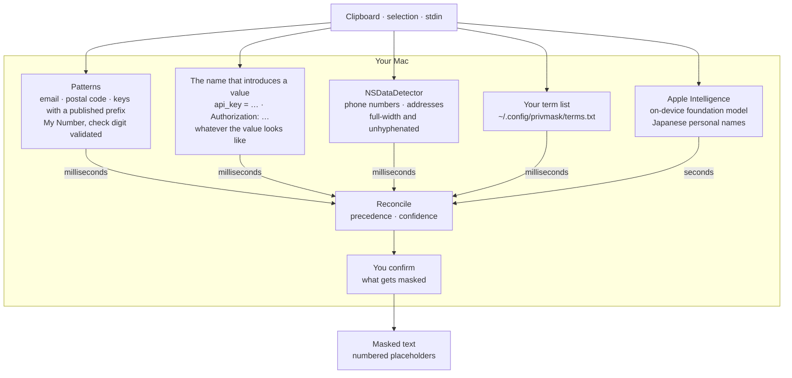

<h1 align="center">🙈<br />privmask</h1>

<p align="center">
  Mask personal information in text before you share it.<br />
  On device, with Japanese handled properly.
</p>

<p align="center">
  <a href="https://github.com/snaka/privmask/releases"></a>
  
  
</p>

---

You are about to paste an incident report into Slack, and there are customer
names in it.

```console
$ cat incident.txt
【障害報告】決済 API のレイテンシが悪化。
一次対応: 田中健一 / 二次対応: 佐藤 美咲
連絡先は 090-1234-5678、メールは suzuki@example.co.jp です。
お客様は株式会社サンプル商事、住所は東京都渋谷区渋谷2丁目21番1号。
デプロイ: commit 4f2a1c9e8b3d / v2.14.3 / req 550e8400-e29b-41d4

$ privmask < incident.txt
【障害報告】決済 API のレイテンシが悪化。
一次対応: [NAME_1] / 二次対応: [NAME_2]
連絡先は [PHONE_1]、メールは [EMAIL_1] です。
お客様は[TERM_1]、住所は[ADDRESS_1]。
デプロイ: commit 4f2a1c9e8b3d / v2.14.3 / req 550e8400-e29b-41d4
```

The commit hash, version and request ID are left alone — masking those would
have ruined the report. The same value always gets the same number, so a reader
can still tell who is who.

Nothing is sent anywhere. No account, no API key, no rules fetched from a
server.

## Install

```sh
brew install snaka/tap/privmask
```

## Usage

```sh
pbpaste | privmask | pbcopy     # mask what you just copied
cat app.log | privmask          # or anything on stdin
cat app.log | privmask --json   # findings as JSON, for tooling
```

Input comes from stdin — there is no file argument. `--help` carries a section
for an agent running this rather than a person, and
[Checking what it found](#checking-what-it-found) describes the `--json` report.

A Raycast extension is planned, to put this on a hotkey with a confirmation
step before anything is replaced. It is not published yet.

## What it finds

| | Found by |
|---|---|
| Phone numbers, addresses | `NSDataDetector`, including full-width and unhyphenated Japanese forms |
| My Number | Pattern plus check digit, so an order number is not mistaken for one |
| Email, postal codes | Patterns |
| Credentials — API keys, tokens, secrets | A published prefix, or the name that introduces the value |
| Your own terms | A list you keep |
| Japanese personal names | Apple Intelligence, on device |
| English personal names | `NLTagger` |

Credentials are found two ways. A value with a published prefix — an AWS access
key ID, a GitHub token, a Slack token, a Stripe secret key, a private key block,
a JWT — is recognised by its shape. Any other value is found by the name that
introduces it: the right-hand side of `api_key = "…"` is a secret whatever it
contains. That second route is the only one that reaches an AWS *secret* access
key, which is 40 characters with no prefix to recognise, or a key issued by a
service that never published a prefix at all.

A value that cannot be live — `YOUR_API_KEY_HERE`, `xxxxxxxx`, digits only — is
reported at low confidence rather than dropped. A rule that dropped it would
eventually drop a real numeric password, and nobody would see it go.

IP addresses, hostnames and internal URLs are deliberately left alone. Whether
they are sensitive is not something a detector can decide, and masking them
wrongly ruins the text.

## Checking what it found

`--json` reports every finding instead of the masked text, so you can see what
was flagged and why before you act on it.

```console
$ printf '担当: 田中健一\nAPI_KEY=wJalrXUtnFEMIK7MDENGbPxRfiCYEXAMPLE\n連絡先 090-1234-5678\n' | privmask --json
{
  "findings" : [
    {
      "confidence" : "low",
      "kind" : "personalName",
      "length" : 4,
      "location" : 4,
      "placeholder" : "[NAME_1]",
      "sources" : [
        "languageModel"
      ],
      "text" : "田中健一"
    },
    {
      "confidence" : "medium",
      "kind" : "credential",
      "length" : 35,
      "location" : 17,
      "placeholder" : "[SECRET_1]",
      "sources" : [
        "credentialContext"
      ],
      "text" : "wJalrXUtnFEMIK7MDENGbPxRfiCYEXAMPLE"
    },
    {
      "confidence" : "medium",
      "kind" : "phoneNumber",
      "length" : 13,
      "location" : 57,
      "placeholder" : "[PHONE_1]",
      "sources" : [
        "dataDetector"
      ],
      "text" : "090-1234-5678"
    }
  ],
  "masked" : "担当: [NAME_1]\nAPI_KEY=[SECRET_1]\n連絡先 [PHONE_1]\n",
  "model" : "used",
  "modelDetail" : null,
  "warnings" : [

  ]
}
```

**`text` carries the original value, so this report is as sensitive as the input
was.** A caller needs it to show someone what is about to be masked, which is
why it is there — but it means the report is the one output you must not paste
anywhere you would not have pasted the input itself. privmask writes it to
stdout and never to a file.

Each finding:

| Field | |
|---|---|
| `kind` | `email`, `phoneNumber`, `address`, `postalCode`, `personalName`, `organizationName`, `placeName`, `myNumber`, `credential`, `dictionaryTerm` |
| `confidence` | `low`, `medium` or `high`. Normally a property of the detector that produced the match, promoted one step when two detectors find the same span independently — agreement is the only cheap evidence there is |
| `sources` | Which detectors found it: `dataDetector`, `nameTagger`, `regex`, `dictionary`, `languageModel`, `credentialContext` |
| `text` | The original value |
| `location`, `length` | Where it sits, as UTF-16 offsets |
| `placeholder` | What replaced it in `masked`, or `null` — two findings can overlap, and only one of them is replaced |

And around them:

| Field | |
|---|---|
| `masked` | The same text `privmask` would have written without `--json` |
| `model` | `used`, `disabled`, `unavailable` or `failed` — a closed set |
| `modelDetail` | Why, when that is not `used`. Otherwise `null` |
| `warnings` | What was not examined. See [Requirements](#requirements): empty is the only value that means every layer ran over the whole input |

Everything found is masked, including low-confidence findings — there is no
confidence threshold to set. The report gives you what you need to decide
otherwise; deciding is the caller's job.

## Requirements

macOS 13 or later.

**Japanese personal names additionally need macOS 26 with Apple Intelligence
enabled.** They are found only by the on-device model, which runs by default
wherever it is available. Where it is not, privmask says so on stderr — and in
the `warnings` array under `--json`. That array is empty only when every layer
ran over the whole input, so it is the one thing to check before treating the
output as safe to pass on.

## Your own terms

Customer names, company names, project code names — the things no general
detector can know are sensitive. One per line:

```
# ~/.config/privmask/terms.txt
株式会社サンプル商事
Project Bluebird
```

Matching ignores case and character width.

## How it works



No arrow leaves that box, and that is not a simplification.

It matters because finding a Japanese personal name takes a language model —
patterns cannot, and neither can `NLTagger`, which has no Japanese entity model
at all. Until the on-device model existed, that capability meant sending the
text to somebody's server: handing over the exact thing you were trying not to
share.

The two speeds are why it feels immediate: the deterministic detectors are shown
straight away, and the model's findings are folded in when they arrive.

## Limits

| | macOS 13 – 25 | 26, Apple Intelligence off | 26, on |
|---|:--:|:--:|:--:|
| Everything except the two rows below | ✅ | ✅ | ✅ |
| **Japanese personal names** | ❌ | ❌ | ✅ |
| Spelling variants of your terms | ❌ | ❌ | ✅ |

- Finding names takes as long as there is Japanese to read. The text is sent to
  the model in chunks of about 1,500 characters, one call after another — the
  on-device model runs them one at a time whatever you do, so a document with a
  lot of Japanese in it takes proportionally longer. Everything is examined; the
  cost is time. `--no-model` skips the whole layer when you would rather have
  the speed. In a terminal, a line on stderr says which chunk it is reading; in
  a pipe, nothing is drawn.
- If a chunk fails, the names in the other chunks are still found and the chunk
  that failed is named in a warning. A warning means that part of the text was
  not examined — not that nothing was.
- A name that competes with others on the same line is missed, run after run.
  In the test corpus a name sharing a line with a company name, a phone number
  and an email is not found at all — not occasionally, every time. Smaller
  chunks do find it, and make the model mask commit hashes and version numbers
  instead ([#1](https://github.com/snaka/privmask/issues/1)).
- Separately, the model varies between runs. A name it finds in one run can be
  missed in the next.
- A credential with neither a recognisable name nor a published prefix is not
  found — scoring values by randomness was rejected because that would also
  flag the commit hash and request ID this README's own example keeps intact.
  The name rule is ASCII only, so `パスワード: hunter2` is not found either.
- An unquoted value is masked only as far as the first space, quote, comma,
  semicolon or closing bracket — stopping there is what keeps the surrounding
  document intact — so a passphrase with spaces in it is only partly covered.
- Masking is **not reversible**. There is no way to recover the original text
  from the output.
- `--no-model` makes privmask fully deterministic and much faster, at the cost
  of the last two rows above.

## Development

```sh
swift test                        # unit, corpus regression and characterisation tests
swift run AppleAPIProbe           # measure the deterministic layer against the corpus
swift run FoundationModelProbe    # measure the full pipeline, model included (slow)
Examples/use 1                    # put a sample text on the clipboard
python3 Scripts/generate-surnames.py   # rebuild the family-name list from SudachiDict
```

[`Corpus/ja-baseline.json`](Corpus/ja-baseline.json) carries both what must be
found and what must never be masked; over-masking ruins the text being shared,
so the negative examples count as much as the positive ones.

[`docs/findings/`](docs/findings/) records what was measured about Apple's
detectors and the on-device model, and how it changed the design. Two of the
defects documented there are worked around in this code — both found by reading
output, not by reasoning about the APIs.

```
Sources/PrivMask/       library: detection and masking
Sources/PrivMaskCLI/    the privmask CLI
Sources/*Probe/         measurement harnesses
Scripts/                generators for the data the detectors check against
Corpus/                 ground truth for the regression test
Examples/               sample texts for trying it by hand
```

`JapaneseSurnames.swift` is generated, not written. The model proposes a span and
that list decides whether it is a name, so a family name missing from it is a
name we found and discarded — which is why it holds every family name
SudachiDict records rather than the few hundred anyone would think to type.

## License

MIT.

The Japanese family-name list in
[`JapaneseSurnames.swift`](Sources/PrivMask/Detection/JapaneseSurnames.swift) is
generated from [SudachiDict](https://github.com/WorksApplications/SudachiDict),
Copyright (c) Works Applications Co., Ltd., licensed under the Apache License,
Version 2.0. SudachiDict's `small_lex.csv` contains a part of UniDic, Copyright
(c) 2011-2013 The UniDic Consortium, under a 3-clause BSD licence.
